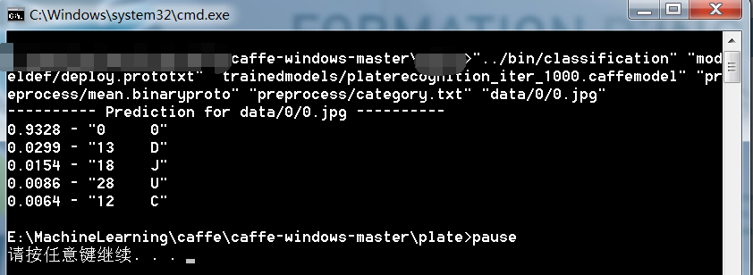
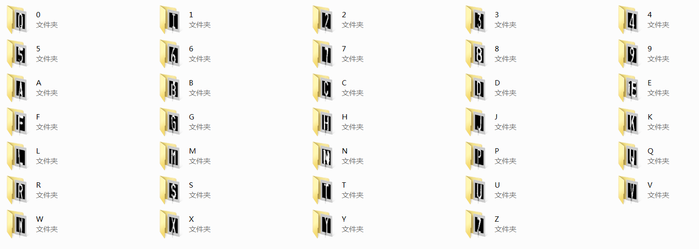

#深度学习入门进阶指南
####Last Update 2016.10.29
  
[![icon]](http://www.tendyron.com/)  
[icon]: http://www.tendyron.com/images/logo.gif
***

#概述

深度学习大火，将各个数据集的state of the art不断地刷新，在解决图像分类、语音识别等问题上获得了已知的最优结果，该系列算法越来越受到学术界和工业界的重视。何为深度学习？一个直观的解释是如果一个机器学习算法在建模的过程中使用了多层的自动特征表示，则该机器学习算法可以称之为深度学习算法，也就是该机器学习算法可以自动地计算特征的特征表示。

当前各类深度学习算法层出不穷，开源的工具库更是多如牛毛。选择太多比没有选择更令人痛苦。我们要感谢这些库的作者们，他们为领域的发展做出了卓越的贡献。这些工具库从使用的语言来分，大致可分为c++类、matlab类、python类和lua类。其中C++类的代表是caffe，难能可贵的是其还配有matlab和python接口，并且可以使用GPU加速，还提供预先训练好的模型，奠定了其在深度学习的领先地位。matlab类的代表是牛津的matconvnet，有GPU加速，上手快，还有精心准备的教程。python类的代表是theano、Keras和pylearn2，有UFLDL的强力支撑，想必一呼百应。lua类的代表是toch7，已经可以和caffe在CVPR2015上一较高下。

但是，我们更应该看到他们的不足。虽然上述这些库都可以跨平台使用，但是配置的难度缺差异很大。caffe依赖很多的第三方库，导致其安装十分繁琐，令很多初学者望而却步。欣喜的是电子科大的王峰博士提供了[一键安装式的教程](如何快糙好猛地在Windows下编译CAFFE并使用其matlab和python接口)，大大方便了caffe的搭建，而华中科大的欧新宇老师提供的[caffe在ubuntu上的安装教程](http://ouxinyu.github.io/Blogs/20151108001.html)也让我信手拈来。theano在windows使用上的坑很多，之前使用python(x,y)，怎么也编译不过theano，无奈放弃了使用theano这么简洁优雅的工具，甚是可惜。后来才发现要使用Anaconda，而且由于2.1后的版本取消了对MinGW的支持，只能选择2.1的版本。这些看似微不足道的细节使我们陷入泥沼，浪费了很多不必要的时间和精力。

一个很自然的想法就是如果有一个能给新手足够的参考资料，那么将会大大降低深度学习的门槛，使更多的研究者享受深度学习带来的福利。经过本人近两年的亲身实践，去伪存真，终得大成之道，此版删除了谬误及不当之处。

本人深知集成式开发、全流程验证的重要性，不同于网上博客分散式只给出几个代码片段的做法，其中的caffe-oneclick完成了从数据预处理、训练、测试以及评估的所有代码，并且以工程化的形式。考虑到大多数使用过Windows的现实状况，还提供了VS2013的解决方案，您只需要在按环境搭建所示的方法搭建好caffe环境后便可一键式运行，省去了各种配置的烦恼。

本文的资料来自于网上各位大神的无私奉献，版权归原作者所有。如果不经意间侵犯了您的正当权益，请联系我删除。

#环境搭建

[如何快糙好猛地在Windows下编译CAFFE并使用其matlab和python接口](http://blog.csdn.net/happynear/article/details/45372231)

[Caffe + Ubuntu 15.04(16.04) + CUDA 7.5(8) 新手安装配置指南](http://blog.csdn.net/shiorioxy/article/details/52652831)

[mxnet训练自己的数据](https://github.com/imistyrain/mxnet-mr)

[MatconvNet使用指南](https://github.com/imistyrain/MatConvNet-mr)

##实现解析

[caffe源码解析](http://blog.csdn.net/qq_16055159)

[caffe代码阅读](http://blog.csdn.net/xizero00/article/category/5619855/)

[从零开始山寨Caffe](http://www.cnblogs.com/neopenx/)

[Caffe代码导读 21天实战caffe作者博客](http://blog.csdn.net/kkk584520/article/category/2620891/2)

[网络结构可视化 在线 ](http://ethereon.github.io/netscope/#/editor)

[CNN卷积神经网络推导和实现](http://blog.csdn.net/zouxy09/article/details/9993371)

[（Caffe）卷积的实现](http://blog.csdn.net/mounty_fsc/article/details/51290446)

[（Caffe，LeNet）反向传播（六）](http://blog.csdn.net/mounty_fsc/article/details/51379395)

[caffe卷积层代码阅读笔记](http://blog.csdn.net/tangwei2014/article/details/47730797)

[caffe的python接口学习](http://www.cnblogs.com/denny402/tag/caffe/default.html?page=2)

##添加新层及样例解析

[Caffe 增加自定义 Layer 及其 ProtoBuffer 参数](http://blog.csdn.net/kkk584520/article/details/52721838)

[caffe添加新层教程](http://blog.csdn.net/shuzfan/article/details/51322976)

[caffe自带样例解析](http://blog.csdn.net/whiteinblue)

[深度卷积网络CNN与图像语义分割](http://blog.csdn.net/xiahouzuoxin/article/details/47789361)

[caffe特征可视化的代码样例](http://blog.csdn.net/lingerlanlan/article/details/37593837)

#caffe-oneclick使用

caffe-oneclick以车牌识别开源项目EasyPR中车牌字符识别为例，提供了一键式的开发环境，在下载完成后需要将这个文件夹拷贝到安装的caffe-windows-master目录下，与其中的bin、python等文件夹保持在同一级目录。

然后右键点击其中的的data.rar，解压到当前目录，点击one-click即可一键式运行，其中的classification.bat用于验证识别一张图片的正确性

其返回了最高的5个类别的相似度，不难看出训练的网络对于data/0/0.jpg有高达93%的概率认为其属于0这个字符，是完全正确的。

每次只运行一张测试图片的做法低效之致，为此提供了evaluation.bat系统的评估一个文件夹下图片识别的准确率，并将错误分类的结果保存在error文件夹下，命名格式为字符文件夹/图片在文件夹内的序号_真值类别_预测类别(以0/17_0_J.jpg为例，代表0/17.jpg被误识为J)，这些错误识别的样本需要仔细分析，不断调试参数，以获得期望的结果。

如果需要在自己的数据集上进行测试，请把收集好的图片分门别类放到各自的文件夹下，然后替换掉data下的这些数据：

网络定义文件在modeldef文件夹下，替换成自己的prototxt文件即可。

#技术交流QQ群

Caffe 深度学习交流群：534492004

MXNet 深度学习交流群：489170253

#Last

以上都是外用工具，作为一名合格的深度学习算法工程师，最重要的还是修炼内功心法，参考

[机器学习路线图](http://blog.csdn.net/longxinchen_ml/article/details/50749614)

如果觉得能帮到您，请记得点右上角的star。